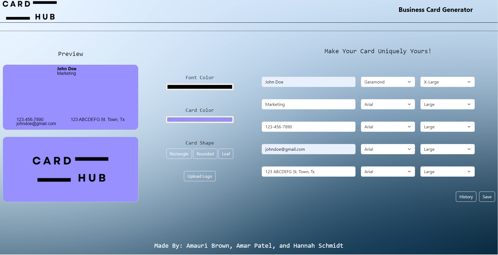

# Business Card Generator#

## Description

- Our motivation was to create a tool that simplifies and moderizes the process of designing business cards, making it accessible for anyone, regargless of design experience. 
- We built CardHub to provide a user-friendly platform where individuals and businesses can easily create professional business cards without needing to hire a designer.
- CardHub addresses the challenge of creating high-quality and customize business cards quickly, especially for small businesses and entrepreneurs who may not have the resources for professional design services.
- Thoughout making CardHub, we learned how to build and integrate and API to manage data efficiently. We also gainedhands-on experience in creating dynamic and responsive interfaces using JavaScript, CSS, and HTML, ensuring a smooth and inuitive user experience.

## Usage

1. Enter Your Information:
- Full Name, Position Title, Website URL, Phone Number, Email, and Address.
- Pick the font you want for each field and the size.

2. Customize The Design:
- Choose your font color.
- Choose what color you want your card to be.
- Upload your logo.

3. Live Preview:
- As your put input information and customize your card, a live preview will show how your business card will look. This allows you to see changes instantly and make adjustments as needed.

    
    

## Credits

- Hannah Schmidt: GitHub - Hannahliz0
- Amauri Brown: GitHub - Amauri817
- Amar Patel: GitHub - pamar123

  